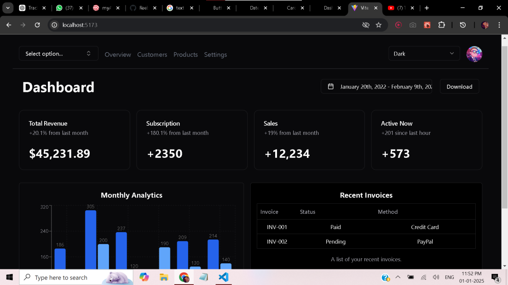

# ShadCN UI Dashboard 🖥️

A **modern and responsive admin/dashboard interface** built with ShadCN UI, React, TypeScript, and Vite.  
This dashboard showcases analytics, charts, recent invoices, and interactive components in a clean and professional layout.

---

## Features

- ✅ Clean, modern dashboard layout  
- ✅ Responsive design (desktop & mobile)  
- ✅ Sidebar navigation and cards  
- ✅ Analytics charts and statistics (mock data)  
- ✅ Recent invoices table  
- ✅ Dark and light mode toggle  
- ✅ Fully customizable with ShadCN UI components  

---

## Screenshot

---

## Tech Stack

- **React 18 + TypeScript**  
- **Vite** for fast development and HMR  
- **Tailwind CSS** for styling  
- **ShadCN UI** components library  
- Optional: Any charting libraries for analytics  

---

## Getting Started

To run the dashboard locally:

1. **Clone the repository**
   
git clone <your-repo-link>
cd shadcn-dashboard

3. **Install dependencies**

npm install
or
yarn install

3. **Start the development server**

npm run dev
or
yarn dev

4. **Open your browser** at http://localhost:5173 (or the port shown in the terminal)
